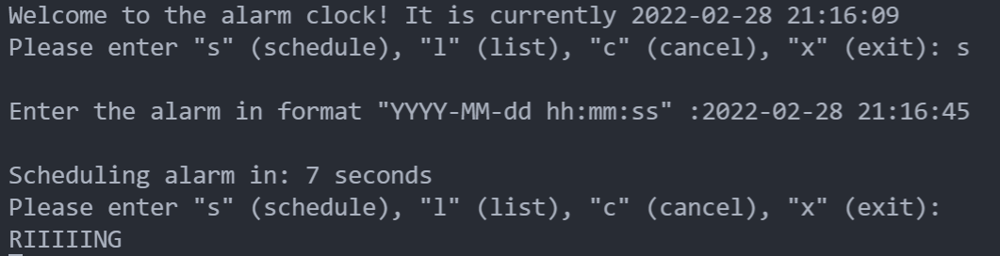
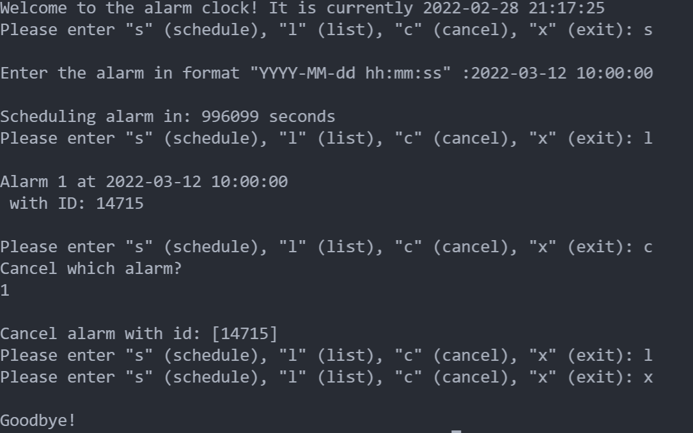
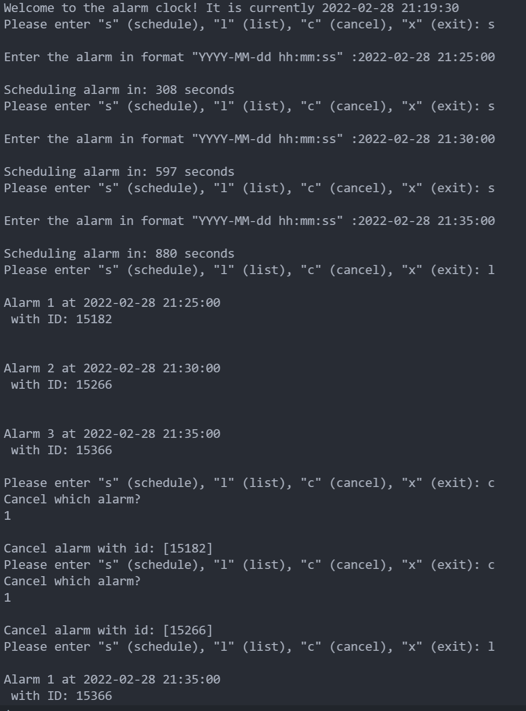
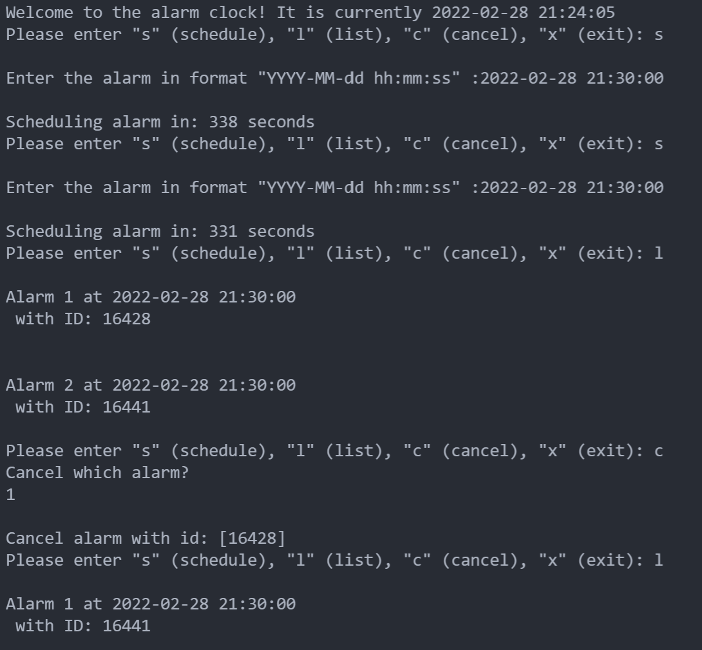

# Operativsystemer

## Øvinger TDT4186

In this practical exercise we are going to implement an alarm clock program in C.

### Run the code

To compile the code, you have to:

```
gcc -o alarmclock alarmclock.c
```

To run the code:

```
./alarmclock
```

### g. Test case documentation

Design four test cases that not only test a single functionality (like scheduling an alarm), but combination of functions of your program.

Describe each test case: what do you do to test this case, what does the test do, what is the expected result?

Are we supposed to write cases for usability tests?

#### First Test Case

The user wants to schedule an alarm and check if the alarm is added to the list and wait for it to go off.

1. What do you do to test this case?
   

   To test this case, firstly you compile and run the program by using the commands written over. Then in the input field you write "s" for schedule a new alarm. The new alarm you are to be scheduling are written in this format YYYY-MM-dd hh:mm:ss, you write 2022-02-24 19:37:10.

2. What does the test do?

   The test tests if scheduling alarm is working, by writing 's' in the input field and expecting the program to run. In addition, the test tests the alarm clock ringing function when the alarm is going off to the scheduled time.

3. What is the expected result?
   The expected result is that the user successfully schedules an alarm that goes off to the right time, and that the ringing function is working while printing out "RIIIIIING" in the terminal.

#### Second Test Case

The user wants to schedule an alarm, but then regrets and cancel it. The user exits the program.
Schedule an alarm, check which alarm to cancel by listing all alarms. Cancel the alarm and checks if the alarm is cancelled, then exits the program.

1. What do you do to test this case?

   

   You run the same procedure as the **The first test case**. You schedule an alarm at 2022-03-22 10:00:00, then checks which alarm to cancel by entering "l". Then cancels the alarm by the number the alarm has, for instance 1 or 2. The user enters "l" to list all alarms, and then presses "x" to exit the program.s

2. What does the test do?

   The test checks if scheduling an alarm is working properly and if it is added to the array of alarms by input "l". Having the list makes it clear which alarm the user wants to cancel. Then tests the cancel function by input "c". To make sure the alarm is cancelled, list the alarms. Then exit the program.

3. What is the expected result?

   The expected result is that scheduling function works and cancelling the alarm works which can be seen if it is in the list or not. In addition to exit the program.

#### Third Test Case

The user wants to cancel the two earliest alarms.

1. What do you do to test this case?

   

   Schedule three alarms with 's', and list all of them with 'l'. Cancel the two earliest alarms with 'c' and then '1' two times. Checks with 'l' that only the last alarm remains in the list.

2. What does the test do?

   The test checks that both the array with alarms updates after each alarm is cancelled. In addition, it checks that the id's which gets scanned after 'c' is updated.

3. What is the expected result?

   The expected result is that only one alarm remains in the list.

#### Fourth Test Case

Schedules three alarms at the same time and cancel one.

1. What do you do to test this case?

   

   Schedule three alarms at the same time with the same procedure mentioned, then list up all to check if they are scheduled. Cancel one, and check if the alarm is cancelled by "l", listing them up again.

2. What does the test do?

   The test tests if there are possibilities of having two alarms at same time by using the programs functionality such as scheduling, cancelling and the ringing function. It also checks that the cancelled alarm actually gets cancelled, and wont ring.

3. What is the expected result?

   The expected result is that the two alarms are ringing at the same time.
